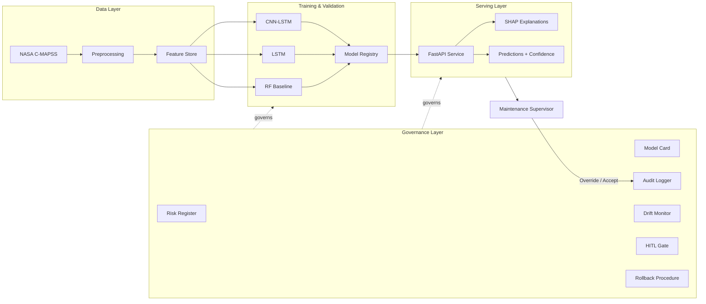

# Industrial AI with Governance-by-Design

### Remaining Useful Life Prediction on NASA C-MAPSS — End-to-End, Production-Grade, Governance-First

[](https://github.com/alanmossinger/cmapss-rul-governance/actions/workflows/ci.yml)
[](https://opensource.org/licenses/Apache-2.0)
[](https://www.python.org/downloads/)
[](./governance/nist-ai-rmf-mapping.md)
[](./governance/eu-ai-act-mapping.md)
[](https://github.com/psf/black)

---

> **Industrial AI is not an IT investment. It is a capital allocation discipline that compounds when governance is designed in from the first commit.**
>
> — Alan Mössinger, Chief AI Officer

---

## What This Repository Is

A production-grade Remaining Useful Life (RUL) prediction system on NASA's C-MAPSS turbofan engine dataset, wrapped in a full AI governance layer aligned to **NIST AI RMF 1.0** and the **EU AI Act** high-risk system requirements.

It exists to demonstrate, end to end, what serious industrial AI looks like when governance, explainability, human oversight, and rollback are first-class concerns — not bolt-ons added after the model ships.

## Why This Project Exists

Most industrial AI projects fail not because the model is wrong, but because the operating model around the model is missing. A predictive maintenance system that cannot explain its predictions to a maintenance supervisor, cannot detect its own drift, cannot be rolled back when it misbehaves, and cannot produce an audit trail when a regulator asks — is not a production system. It is a liability.

This repository codifies the alternative: every model decision is **attributable, auditable, reversible, and overrideable**. The same engineering rigor applied to financial controls is applied to ML controls.

## At a Glance

| Component | Choice | Rationale |
|---|---|---|
| **Task** | Remaining Useful Life (RUL) prediction | High-value industrial AI archetype; clear economic linkage to maintenance cost and unplanned downtime |
| **Dataset** | NASA C-MAPSS FD001 – FD004 | Public, peer-validated, multi-condition, multi-fault-mode |
| **Models** | Random Forest → LSTM → CNN-LSTM | Progressive complexity with measurable lift at each stage |
| **Explainability** | SHAP (TreeExplainer + DeepExplainer) | Per-prediction attribution surfaced through the API for HITL review |
| **Serving** | FastAPI + Pydantic v2 | Type-safe contracts, OpenAPI by default, audit-friendly logging |
| **Governance** | NIST AI RMF + EU AI Act mapping, model card, risk register, drift monitor, HITL gate, rollback procedure, audit trail | High-risk industrial AI alignment |

## Architecture



## The Governance Layer — The Differentiator

Anyone can train a CNN-LSTM on C-MAPSS. Far fewer can ship one that survives a regulator's review.

This repository includes:

- **[Model Card](./governance/model-card.md)** — intended use, out-of-scope use, training data provenance, performance by sub-population (operating condition), known limitations, ethical considerations
- **[Risk Register](./governance/risk-register.md)** — enumerated risks with likelihood × impact scoring, owners, mitigations, residual risk acceptance
- **[NIST AI RMF Mapping](./governance/nist-ai-rmf-mapping.md)** — GOVERN, MAP, MEASURE, MANAGE functions mapped to concrete repository artifacts
- **[EU AI Act Mapping](./governance/eu-ai-act-mapping.md)** — Article-by-article alignment for high-risk industrial AI systems
- **[Data Card](./governance/data-card.md)** — dataset provenance, sampling, known biases, refresh cadence
- **[HITL Protocol](./governance/hitl-protocol.md)** — when human review is mandatory, who reviews, how disagreements are logged
- **[Rollback Procedure](./governance/rollback-procedure.md)** — incident response, rollback triggers, model-version pinning
- **[Drift Monitoring](./governance/drift-monitoring.md)** — feature drift, prediction drift, concept drift; thresholds and escalation
- **[Audit Trail](./governance/audit-trail.md)** — what gets logged, retention, access control

Each model release must pass the [governance-check workflow](./.github/workflows/governance-check.yml) before merge — meaning the governance artifacts are not optional documentation, they are CI gates.

## Model Performance

| Model | RMSE (FD001) | RMSE (FD002) | RMSE (FD003) | RMSE (FD004) | Params | Inference (ms) |
|---|---|---|---|---|---|---|
| Random Forest | _TBD_ | _TBD_ | _TBD_ | _TBD_ | _TBD_ | _TBD_ |
| LSTM | _TBD_ | _TBD_ | _TBD_ | _TBD_ | _TBD_ | _TBD_ |
| CNN-LSTM | _TBD_ | _TBD_ | _TBD_ | _TBD_ | _TBD_ | _TBD_ |

_Populated as models ship. The RF baseline is intentional — every production system needs an interpretable floor against which deep models must justify their complexity._

## Explainability

SHAP values are computed for every prediction and returned alongside the RUL estimate. The API response includes:

- Predicted RUL (cycles)
- Confidence interval
- Top-k feature contributions (signed SHAP values)
- Reference distribution for the predicted sub-population

This is what enables HITL: a maintenance supervisor receiving a "schedule overhaul in 8 cycles" alert can see _why_ — and override if domain context contradicts the model.

## Quick Start

```bash
# Clone
git clone https://github.com/alanmossinger/cmapss-rul-governance.git
cd cmapss-rul-governance

# Environment
python -m venv .venv && source .venv/bin/activate
pip install -e ".[dev]"

# Download C-MAPSS data (see data/README.md for source)
python scripts/download_data.py

# Train baseline
python scripts/train.py --model rf --dataset FD001

# Train CNN-LSTM
python scripts/train.py --model cnn_lstm --dataset FD001

# Serve
uvicorn cmapss_rul.api.main:app --reload

# Open API docs
open http://localhost:8000/docs
```

## Project Structure

```
cmapss-rul-governance/
├── .github/                  # CI, issue templates, PR template, CODEOWNERS
├── docs/                     # Architecture, executive brief, diagrams
├── governance/               # NIST AI RMF + EU AI Act artifacts (the differentiator)
├── src/cmapss_rul/
│   ├── data/                 # Loading, preprocessing, feature engineering
│   ├── models/               # RF, LSTM, CNN-LSTM
│   ├── explainability/       # SHAP analysis
│   ├── governance/           # Drift, HITL, audit logger (governance as code)
│   └── api/                  # FastAPI service
├── tests/                    # pytest — unit, integration, governance gates
├── notebooks/                # EDA and model-development notebooks
├── scripts/                  # Training, evaluation, serving entry points
├── data/                     # Raw and processed (not committed)
└── models/                   # Trained artifacts (not committed; tracked via registry)
```

## Standards Alignment

| Framework | Alignment |
|---|---|
| **NIST AI RMF 1.0** | GOVERN, MAP, MEASURE, MANAGE — [mapping](./governance/nist-ai-rmf-mapping.md) |
| **EU AI Act** | High-risk system requirements (Articles 9–15) — [mapping](./governance/eu-ai-act-mapping.md) |
| **ISO/IEC 42001** | AI management system principles |
| **ISO/IEC 23894** | AI risk management |

## Roadmap

- [x] Repository scaffold + governance artifact stubs
- [x] Data pipeline (loading, sliding-window features, normalization)
- [x] Random Forest baseline + SHAP TreeExplainer
- [x] LSTM model + training loop with early stopping
- [x] CNN-LSTM model + SHAP DeepExplainer
- [x] FastAPI service with audit logging
- [x] Drift detection (Kolmogorov-Smirnov, Population Stability Index)
- [x] HITL gate implementation
- [x] Docker container + health checks
- [x] Governance-check CI workflow enforcement
- [x] Model card auto-generation from training run

## Author

**Alan Mössinger** — CEO & Chief AI Officer, VEX AI-Tech · 20 Years at Petrobras

20+ years leading AI, data science, and digital transformation across regulated, asset-intensive energy environments.

- [LinkedIn](https://www.linkedin.com/in/alan-mossinger)
- [Medium](https://medium.com/@alanmossinger)
- [VEX AI-Tech](https://vexaitech.com)

## Citation

If you reference this work:

```bibtex
@software{mossinger2026cmapssrul,
  author = {Mössinger, Alan},
  title  = {Industrial AI with Governance-by-Design: RUL Prediction on NASA C-MAPSS},
  year   = {2026},
  url    = {https://github.com/alanmossinger/cmapss-rul-governance}
}
```

NASA C-MAPSS dataset citation:

```bibtex
@inproceedings{saxena2008cmapss,
  author    = {Saxena, A. and Goebel, K. and Simon, D. and Eklund, N.},
  title     = {Damage Propagation Modeling for Aircraft Engine Run-to-Failure Simulation},
  booktitle = {International Conference on Prognostics and Health Management},
  year      = {2008}
}
```

## License

Apache License 2.0 — see [LICENSE](./LICENSE).
