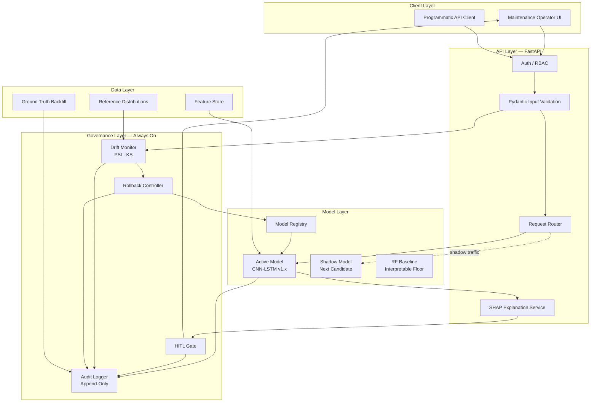
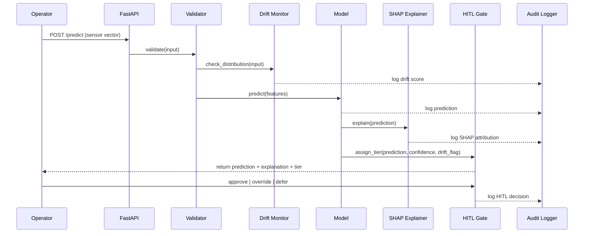
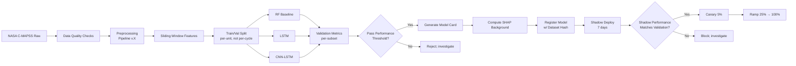

# Architecture

## System View

## Request Flow — A Single Prediction

## Model Training Pipeline

## Component Responsibilities

| Component | Responsibility | Source path |
|---|---|---|
| Data loader | Read C-MAPSS, validate schema, hash dataset | `src/cmapss_rul/data/loader.py` |
| Preprocessor | Normalize, window, regime-detect | `src/cmapss_rul/data/preprocessing.py` |
| RF baseline | Interpretable performance floor | `src/cmapss_rul/models/baseline_rf.py` |
| LSTM | Sequence model, intermediate complexity | `src/cmapss_rul/models/lstm.py` |
| CNN-LSTM | Production model | `src/cmapss_rul/models/cnn_lstm.py` |
| SHAP service | Per-prediction attribution | `src/cmapss_rul/explainability/shap_analysis.py` |
| Drift monitor | PSI, KS, alerting | `src/cmapss_rul/governance/drift.py` |
| Audit logger | Append-only structured logs | `src/cmapss_rul/governance/audit_logger.py` |
| HITL gate | Tier assignment, override capture | `src/cmapss_rul/governance/hitl.py` |
| API service | Public interface | `src/cmapss_rul/api/main.py` |

## Non-Functional Requirements

| Concern | Target |
|---|---|
| Prediction latency (p95) | < 200 ms including SHAP |
| API availability | 99.9% monthly |
| Audit-log durability | Zero loss under nominal load; durable queue with at-least-once delivery |
| Drift-monitor cadence | Daily; alert within 1 hour of breach |
| Rollback time | < 60 seconds from decision to traffic-shifted |
| Model retraining | Quarterly, or upon drift-triggered |
